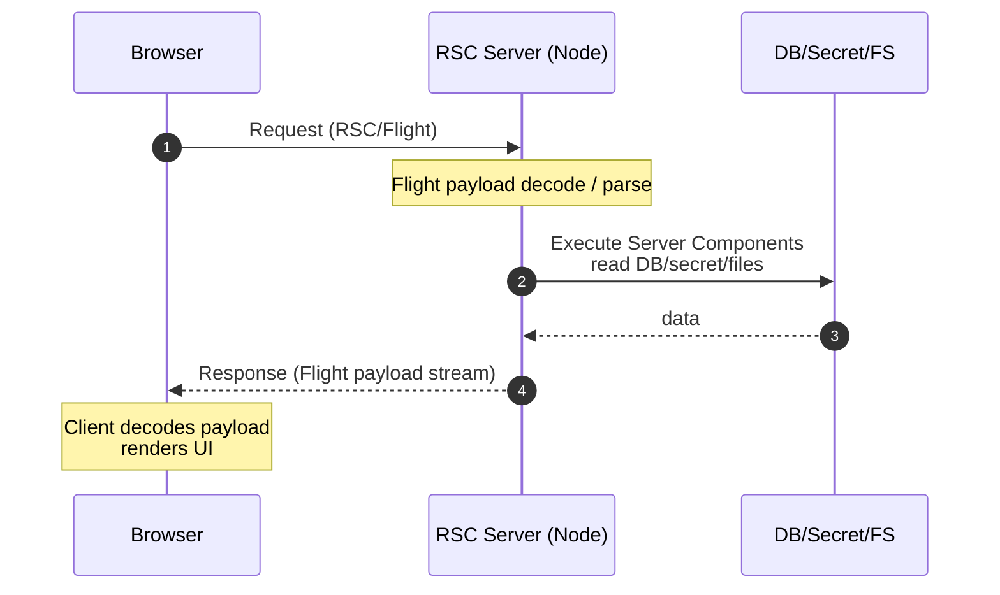

# 0. このノートの目的（読むと何がわかる？）

2025年12月に公開・悪用が観測された **React Server Components（RSC）関連の重大脆弱性**（通称 React2Shell / **CVE-2025-55182**）を理解するために、次を **1本のナレッジ**としてまとめる。

- RSC（React Server Components）が何か（なぜ生まれ、何が違うか）
- RSCが依存する **Flight protocol** が何をしているか
- 今回の脆弱性がなぜ **「認証不要RCE」** になり得るのか（概念レベルで）
- 影響範囲（React/Next.js/周辺）と、運用での対策・検知ポイント

> ※このノートは「防御・理解」を目的とし、悪用を直接助ける具体的な手順やペイロード、再現コードは書かない。  
> ただし、設計・運用上の論点は深く書く。

---

# 1. まず結論：2025年12月の何がヤバかったのか

Reactチームは **React Server Components に “認証不要のRCE（Remote Code Execution）” がある**と公表し、緊急アップデートを推奨した。これは **Flight protocol のデコード処理（payload復元）周り**が焦点になっている。:contentReference[oaicite:0]{index=0}

日本国内でも公的機関（IPA/JVN/JPCERT/CC）が注意喚起し、国内で悪用が発生している可能性や PoC 公開・悪用試行の観測が言及された。:contentReference[oaicite:1]{index=1}

加えて、脅威インテリジェンス各社が「公開直後から複数の攻撃者に悪用されている」状況を報告している。:contentReference[oaicite:2]{index=2}

---

# 2. RSC（React Server Components）とは何か

## 2.1 一言で言うと

**「Reactのコンポーネントをサーバー側で実行し、クライアントには“描画に必要な情報”だけをストリーミングする仕組み」**。

React公式の説明でも、Server Components は “クライアントアプリやSSRサーバとは別環境の ‘server’ でレンダリングされ得る” という位置づけになっている。:contentReference[oaicite:3]{index=3}

## 2.2 従来のCSR/SSRとの違い（攻撃面の観点）

従来の代表構成はこう：

- **CSR（SPA）**：ブラウザでJSが動き、API（JSON）を叩いて描画
- **SSR**：サーバでHTMLを生成して返す（HydrationでJSが生きる）
- **RSC**：サーバで“コンポーネント”を実行し、結果を **Flight** で返す（HTML/JSONではない）

| 観点 | CSR | SSR | RSC |
|---|---|---|---|
| 主な返却物 | JSON/HTML/JS | HTML + JS | **Flight payload（独自）** |
| サーバ実行ロジック | API層に集中 | SSR層に集中 | **UI層（コンポーネント）がサーバで実行** |
| “入力→実行”距離 | API設計次第 | テンプレ中心 | **payload decode → 内部表現復元 → 実行に近い** |
| セキュリティの難所 | API認可/入力検証 | XSS/テンプレ注入 | **複雑なデシリアライズ/プロトコル実装** |

RSCは便利な一方、**“UI層がサーバで動く”** ので、サーバ側の攻撃面が増える。これは「フロントの脆弱性＝XSSが中心」という直感を壊す。

---

# 3. Flight protocol とは何か

## 3.1 一言で言うと

**RSCの実行結果（コンポーネントツリー）をクライアントに送るための通信プロトコル**。RSCが成立する土台。

OffSecの解説でも「RSCは Flight と呼ばれるプロトコルで通信する」と整理されている。:contentReference[oaicite:4]{index=4}  
WizやPalo Alto Unit42なども、今回の脆弱性は **“RSCのFlightプロトコル実装”** に紐づくと説明している。:contentReference[oaicite:5]{index=5}

## 3.2 何を運ぶ？（概念）

Flightが運ぶのは「HTML」でも「単純なJSON」でもなく、ざっくり言うと：

- サーバ側で実行されたコンポーネントツリーの“結果”
- props や参照関係
- ストリーミングのための断片
-（場合により）次に必要なチャンク情報

ここで重要なのは、**受信側（サーバ/クライアント）が payload を “decode / deserialize” して内部表現に戻す**という点。  
そしてこの **デシリアライズが複雑**になりやすいことが、セキュリティ上のボトルネックになる。

---

# 4. RSCの通信フロー（ざっくり全体像）

ここでは “概念としての流れ” を押さえる。フレームワーク（例：Next.js）で実装は異なるが、基本構造は共通。

## 4.1 RSCレンダリングフロー（イメージ）

- **攻撃面が生まれるポイント**は `Flight payload decode / parse`。  
    ここに「外部入力」が入り、実装が複雑だと事故りやすい。
    

## 4.2 “Server Functions / Server Actions” との関係

React側の公表文では「Server Function endpoints に送られる payload を decode する方法の欠陥」が言及されている。[react.dev+1](https://react.dev/blog/2025/12/03/critical-security-vulnerability-in-react-server-components?utm_source=chatgpt.com)  
つまり **RSCの世界では “関数呼び出し” もプロトコルで表現され得る**。

- 「関数呼び出し」＝「実行」
    
- そこに payload decode の欠陥がある
    
- すると **入力が実行に直結**しやすい
    

この “距離の短さ” が、RCEの温床になり得る。

---

# 5. 今回の脆弱性（React2Shell / CVE-2025-55182）の本質

## 5.1 公表内容の要点（防御側の理解）

- **認証不要のRCE**（Unauthenticated RCE）
    
- 原因は **信頼できないデータのデシリアライズ（CWE-502）** として整理されている [情報処理推進機構+2jvn.jp+2](https://www.ipa.go.jp/security/security-alert/2025/alert20251209.html?utm_source=chatgpt.com)
    
- Reactチームは「直ちにアップデート」を推奨し、GitHub Advisoryでも修正版が明記されている [GitHub+1](https://github.com/facebook/react/security/advisories/GHSA-fv66-9v8q-g76r?utm_source=chatgpt.com)
    
- 公式だけでなく、国内外の複数機関が影響・悪用観測を報告している [JP-CERT+2Google Cloud+2](https://www.jpcert.or.jp/newsflash/2025120501.html?utm_source=chatgpt.com)
    

## 5.2 “なぜRCEになるのか” を概念で説明する

ここが最重要。ざっくり言うと：

1. RSCは **Flight payload** を受け取る（外部入力）
    
2. サーバはそれを decode し、内部表現に復元する（deserialize）
    
3. 復元した情報を元にサーバ側ロジック（コンポーネント/関数）を実行する
    
4. decode/deserialize が不適切だと、攻撃者が **意図しない内部表現** を作り出せる
    
5. 結果として **サーバが “実行してはいけないもの” を実行**してしまう可能性がある
    

> つまり **「プロトコル実装の欠陥」＝「入力から実行へのショートカット」**。

これが、RSC/Flightが“便利な抽象化”であるほど危険になり得る理由。

---

# 6. 影響範囲：どれが危ない？（棚卸し観点）

## 6.1 影響パッケージとバージョン

GitHub Security Advisory によると、RSC関連のパッケージで影響があり、修正版は以下（例）が提示されている。[GitHub+1](https://github.com/facebook/react/security/advisories/GHSA-fv66-9v8q-g76r?utm_source=chatgpt.com)

- 影響：React 19 系の RSC 関連パッケージ（例：react-server-dom-webpack 等）
    
- 修正：**19.0.1 / 19.1.2 / 19.2.1**（いずれかへアップデート）[GitHub+1](https://github.com/facebook/react/security/advisories/GHSA-fv66-9v8q-g76r?utm_source=chatgpt.com)
    

※具体の依存関係はフレームワークやbundlerにより変わる。  
Vercel（Next.js運用母体）も本件を「React 19と、その上で動くフレームワークに影響する」と整理している。[Vercel](https://vercel.com/changelog/cve-2025-55182?utm_source=chatgpt.com)

## 6.2 「自分はRSC使ってない」でも危険になり得る理由

IPAの注意喚起でも「Next.jsなど他製品も同様の影響を受ける」と明記されている。[情報処理推進機構](https://www.ipa.go.jp/security/security-alert/2025/alert20251209.html?utm_source=chatgpt.com)  
つまり、

- 自分のコードがRSCを直接書いていなくても
    
- **フレームワークが内部でRSC/Flightを扱っている**
    
- 依存に `react-server-dom-*` が入り、サーバ側で decode が動く
    

というケースがある。

> “使ってないつもり” が危険。  
> **実際に依存に入っているか**で判断する。

---

# 7. 追加で出た脆弱性（RCEではないが重要）

Reactチームは、RCE修正後の検証過程で **DoS やソースコード露出**など、追加の脆弱性が見つかったことも公表している。[react.dev](https://react.dev/blog/2025/12/11/denial-of-service-and-source-code-exposure-in-react-server-components?utm_source=chatgpt.com)

- 「RCEパッチは有効」だが
    
- その後 **追加の問題が連鎖**した
    

これは、重大脆弱性の後に「周辺が集中的に掘られる」典型パターンで、Googleの脅威インテリジェンスも “追加3件のReact脆弱性が公開された” と言及している。[Google Cloud](https://cloud.google.com/blog/topics/threat-intelligence/threat-actors-exploit-react2shell-cve-2025-55182?utm_source=chatgpt.com)

運用面の教訓：

- **“RCE直したら終わり” になりがち**だが、こういう局面では **周辺CVEもまとめて対応**が合理的。
    

---

# 8. 攻撃の現実：観測されている（机上の空論ではない）

複数の機関・企業が「公開直後から悪用」や「複数攻撃者による大規模悪用」を報告している。[Google Cloud+2Unit 42+2](https://cloud.google.com/blog/topics/threat-intelligence/threat-actors-exploit-react2shell-cve-2025-55182?utm_source=chatgpt.com)

- Google Threat Intelligence は、暗号資産マイニング（XMRig）などの展開も含め、観測事例に触れている [Google Cloud](https://cloud.google.com/blog/topics/threat-intelligence/threat-actors-exploit-react2shell-cve-2025-55182?utm_source=chatgpt.com)
    
- Unit42 は React側CVEとNext.js側CVEの整理（重複扱い）を含め、RSC Flight絡みの脅威として解説している [Unit 42](https://unit42.paloaltonetworks.com/cve-2025-55182-react-and-cve-2025-66478-next/?utm_source=chatgpt.com)
    
- 国内でもJPCERT/CCおよびJVNが PoC公開や悪用試行を示唆 [JP-CERT+1](https://www.jpcert.or.jp/newsflash/2025120501.html?utm_source=chatgpt.com)
    

結論：

> **「まだ様子見」ではなく、パッチ適用と調査を同時にやるべきカテゴリ**。

---

# 9. 対策（設計・実装・運用）を “漏れなく” まとめる

## 9.1 まずは影響判定（SCA / 依存棚卸し）

### 判定の最短ルート

- `react-server-dom-*`（webpack/parcel/turbopack等）が入っているか
- React 19 系 + RSC対応フレームワーク（Next.jsなど）を使っていないか

例（コマンドは環境に合わせる）：

- npm:
    
    - `npm ls react-server-dom-webpack react-server-dom-parcel react-server-dom-turbopack`
        
- yarn:
    
    - `yarn why react-server-dom-webpack`
        

> **“入ってたら要対応”** が基本線。  
> 公式Advisoryの修正版へ上げる。[GitHub+1](https://github.com/facebook/react/security/advisories/GHSA-fv66-9v8q-g76r?utm_source=chatgpt.com)

## 9.2 パッチ適用（最優先）

React公式・GitHub Advisoryが示す修正版へアップデートする。[GitHub+1](https://github.com/facebook/react/security/advisories/GHSA-fv66-9v8q-g76r?utm_source=chatgpt.com)  
Vercelも、影響と緩和の概要を公開している。[Vercel](https://vercel.com/changelog/cve-2025-55182?utm_source=chatgpt.com)

### ポイント

- “React本体だけ” ではなく、RSC関連パッケージが対象になり得る
- lockfile更新と再デプロイまで含めて完了

## 9.3 暫定緩和（パッチが間に合わないとき）

根治はアップデートだが、現実には「全システム一斉更新が難しい」ことがある。その場合の暫定策：

- WAF/リバースプロキシで異常なリクエストをブロック（ただし完全防御ではない）
- RSC/Flight相当のエンドポイントやルートを特定し、監視を強化
- アプリ権限を最小化（Nodeプロセス権限、実行ユーザ、ファイル権限、外向き通信制限）

> ただし「プロトコル実装の欠陥」はバイパスされやすく、暫定策は “時間稼ぎ” と割り切る。

## 9.4 侵害調査（すでに踏まれていないか）

IPA/JVN/JPCERT/CC は国内悪用の可能性に触れているため、パッチ前後で調査観点を持つ。[情報処理推進機構+2jvn.jp+2](https://www.ipa.go.jp/security/security-alert/2025/alert20251209.html?utm_source=chatgpt.com)

最低限の調査観点（一般論）：

- 直近数日〜数週間のアクセスログ保全（公開直後のスキャンが多い）
- 不審なプロセス、想定外のcron、未知のバイナリ/スクリプト
- 外向き通信（未知のドメイン、マイニング、C2など）  
    ※GTIGはマイニング展開の観測に言及 [Google Cloud](https://cloud.google.com/blog/topics/threat-intelligence/threat-actors-exploit-react2shell-cve-2025-55182?utm_source=chatgpt.com)

---

# 10. “なぜRSC/Flightは事故りやすいのか” を設計の言葉で整理

ここからは教訓を抽象化して、次の設計レビューに使える形にする。

## 10.1 抽象化が強いほど「境界」が見えにくい

RSCは開発者体験としては：

- “サーバで実行してる” ことを薄く隠す
- “通信してる” ことも隠す
- “関数呼び出し” が “HTTP入力” であることを意識しにくい

結果、セキュリティの基本である

- 入力バリデーション
- 認証/認可境界
- 例外処理
- ログ設計

が見落とされやすい。

## 10.2 “デシリアライズ” は常に危険

今回のCVEは、CWE-502（信頼できないデータのデシリアライズ）として説明されている。[jvn.jp+1](https://jvn.jp/vu/JVNVU91640936/?utm_source=chatgpt.com)  
このカテゴリは昔から「RCEに直結しやすい」ことで有名。
Flightはまさに「複雑なデータの復元」をするので、設計上の最重点監視ポイントになる。

## 10.3 “入力→実行”の距離が短いのが最悪

RSC/Flightは、外部からのpayloadが内部表現に復元され、そのまま実行系（コンポーネント/関数）に繋がり得る。

- API層のような明確な境界が薄い
- “UIの一部” として動いてしまう
- 一般的な脅威モデリングで見落としやすい

---

# 11. 監査・レビューで使えるチェックリスト（RSC採用時）

## 11.1 アーキ観点

-  RSC/Flightを処理するサーバの実体はどこ？（Node? Edge?）
-  RSC通信が通る経路（CDN/WAF/ALB/Reverse Proxy）は？
-  実行ユーザ権限は最小化されているか（FS/Secret/Outbound）
-  ログ（アクセス/アプリ/例外）を相関できるか

## 11.2 依存管理観点（今回の教訓）

-  `react-server-dom-*` のバージョンをSCAで継続監視しているか
-  lockfile更新→CI→デプロイまでのリードタイムはどれくらいか
-  “重大CVE時の緊急アップデート手順” がドキュメント化されているか 

## 11.3 運用観点

-  公表直後のスキャン増加に耐えるレート制限/防御はあるか
-  インシデント時のログ保全（期間・保管先・責任者）は決まっているか
-  侵害調査の手順（プロセス/ファイル/通信/権限確認）はあるか

---

# 12. 参考情報（一次情報を優先）

- React公式：Critical Security Vulnerability in React Server Components（2025-12-03）[react.dev](https://react.dev/blog/2025/12/03/critical-security-vulnerability-in-react-server-components?utm_source=chatgpt.com)
- GitHub Advisory（facebook/react）：GHSA（修正版 19.0.1 / 19.1.2 / 19.2.1）[GitHub](https://github.com/facebook/react/security/advisories/GHSA-fv66-9v8q-g76r?utm_source=chatgpt.com)
- NVD：CVE-2025-55182（説明・メトリクス）[NVD](https://nvd.nist.gov/vuln/detail/CVE-2025-55182?utm_source=chatgpt.com)
- React公式：追加のDoS/ソース露出（2025-12-11）[react.dev](https://react.dev/blog/2025/12/11/denial-of-service-and-source-code-exposure-in-react-server-components?utm_source=chatgpt.com)
- IPA：注意喚起（国内での悪用可能性も言及）[情報処理推進機構](https://www.ipa.go.jp/security/security-alert/2025/alert20251209.html?utm_source=chatgpt.com)
- JPCERT/CC：ニュースフラッシュ（PoC公開・悪用可能性）[JP-CERT](https://www.jpcert.or.jp/newsflash/2025120501.html?utm_source=chatgpt.com)
- JVN：JVNVU（CWE-502としての整理、悪用試行の観測）[jvn.jp](https://jvn.jp/vu/JVNVU91640936/?utm_source=chatgpt.com)
- Palo Alto Unit42：Flight protocolのRCEとして解説（React/Next重複の整理）[Unit 42](https://unit42.paloaltonetworks.com/cve-2025-55182-react-and-cve-2025-66478-next/?utm_source=chatgpt.com)
- Google Threat Intelligence：複数攻撃者による悪用、追加CVEにも言及 [Google Cloud](https://cloud.google.com/blog/topics/threat-intelligence/threat-actors-exploit-react2shell-cve-2025-55182?utm_source=chatgpt.com)
- Vercel：CVE-2025-55182の要約（Next.js含む影響整理）[Vercel](https://vercel.com/changelog/cve-2025-55182?utm_source=chatgpt.com)
    

---

# 13. 次に深掘りするなら（発展）

このノートの次は、用途別に分けると整理しやすい：

1. **技術深掘り編**：RSC/Flightの概念をもう1段階下げて「どんな種類のデータが流れ、どこで復元されるか」を図解（※悪用に踏み込まない範囲で）
2. **運用編**：緊急パッチ適用フロー、SCA自動化、検知ルールの設計（ログ項目・アラート条件）
3. **設計レビュー編**：RSC採用判断の質問リスト（要件定義/基本設計のレビュー観点）

必要なら、あなたの環境（Next.jsの有無、App Router採用、デプロイ先）を前提にした **影響判定フローチャート（Yes/No）** と **インシデント一次対応テンプレ** まで、Obsidian用に続編mdで出す。